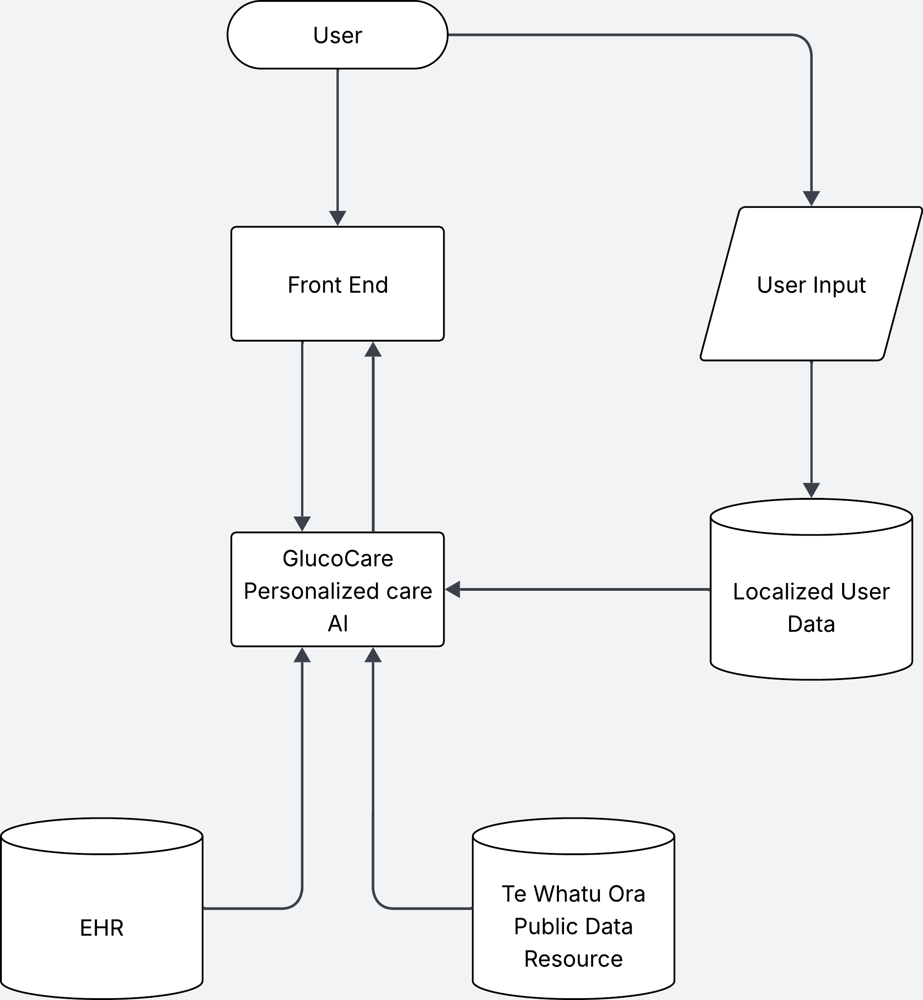

# GlucoCare

Diabetes Management Application

# Prototype
[Prototype](https://www.figma.com/proto/fp31nzVarWBfVf5cnIFnJ9/Wireframing?node-id=92-141&p=f&t=8BFNQAdpuVPZSi9U-1&scaling=scale-down&content-scaling=fixed&page-id=0%3A1&starting-point-node-id=92%3A141)

## Vision, Problem statement, and Solution

Type 2 diabetes is a growing challenge in New Zealand, costing $2.1 billion per year and projected to rise to $3.5 billion in the next 20 years [1], while patients struggle to manage their condition effectively. We envision a system where patients can easily access and understand their health information, reducing complications and improving overall quality of life. Our proposed app utilizes Shared Digital Health Records (SDHR) to help patients manage their diabetes, easing pressure on healthcare systems and freeing up resources for those who need them most.

## Motivation

- Increase productivity through better allocation of resources
- Patient empowerment through data-driven tools

### Benefits of the app

#### For patients

- Personalised user-interface.
- Easier self-management of diabetes, leading to fewer complications
- Improved quality of life and reduced stress through clear, visual, and easily accessible health data

#### For healthcare providers

- Reduced strain on healthcare providers
  - e.g., Reduced hospital visits [2]
- Allows providers to allocate resources more effectively to patients in need

[1]: https://static1.squarespace.com/static/5a1b161b6957daf4c4f3b326/t/61e8786f1229ac6ea63ec596/1642625139085/PwC+Economic+and+Social+Cost+of+Type+2+Diabetes+-+FINAL+REPORT+Executive+Summary+17.11.2020+-+Secure.pdf
[2]: https://onlinedegrees.valpo.edu/reducing-healthcare-costs-with-preventative-health-measures/

# Data Story

Here is the flow of the system we propose. We get data from the national Electronic Health Record to show a patients prescribed care plan, as well as data provided directly by Te Whatu Ora and other public health organization’s for targeted education plans. Users can also input their own data to further personalize the care plan and other resources they receive.

By integrating regional diabetes distribution datasets like those provided by Te Whatu Ora, we can focus our efforts and resources on the areas where we can prevent the most complications and generate the greatest return on our healthcare investments.

Areas such as Manukau make up one sixth of the total number of diabetes cases on the register. If our system prevents a complication for just a tiny fraction of these regions, the potential savings are in the tens of millions of dollars annually in just one district.

## Digital Health Record

- Patient Information: Full Name, Date of Birth, Gender, Ethnicity
- Medical History: Past and current diagnoses (diabetes diagnoses)
- Prescribed medication: Current and past prescribed medication.

## Application Layer

- Blood Sugar: Levels
- Insulin: Doses, Units (milliliters)
- Appointments: Location, Date / Time, Details

## GlucoCare Data Flow Diagram

# Team Members
* [John Yoo](https://github.com/ExtraBlackBerry)
* [Chelsea Ferguson](https://github.com/devchelseaa)
* [Foster Rae](https://github.com/FosterSenpai)
* [Demarjio Brady](https://github.com/0xdembyte)
